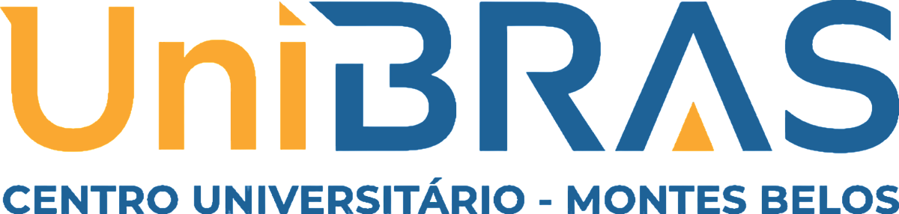

# UNIBRAS - Modelo de Documento para Projetos, Pesquisas e Disciplinas Específicas

<p align="center">
  <a href="https://sejaunibras.com.br"></a>
</p>

---

## 📌 Covertor decimal,exadecimal,octal e binario

### 👥 Aluno

* [Arthur Brito de Cerqueira Silva]


### 👔 Docentes e Orientação

* **Orientador(a):** [FRANCISMAR ALVES MARTINS JUNIOR](https://www.linkedin.com/in/francismar-alves-martins-junior-8a320b90/)

---
### ⚡️ Anexos e Links
 
 (documents/visualcodigo.pdf)
------

### ⚡️ Arquitetura e Stack Utilizado

* **Linguagem de Programação:** Ex.: Java, Python, C#
* **Framework(s):** Ex.: Spring Boot, Django, React
* **Banco de Dados:** Ex.: PostgreSQL, MySQL
* **Bibliotecas e Ferramentas de Suporte:** Ex.: Pandas, Scikit‑Learn, JUnit

### 🛠️ Estrutura do Repositório

```python
templatesUNIBRAS/
├─ assets/
│  └─ (imagens, logotipos e recursos visuais para o README e templates)
├─ document/
│  └─ (modelos de documentos em .docx, .pdf ou .md para diferentes usos)
├─ src/
│  └─ (código fonte de exemplos, scripts de automação ou templates LaTeX, se existirem)
├─ .gitattributes
├─ .gitignore
├─ LICENSE
├─ README.md
```
---
